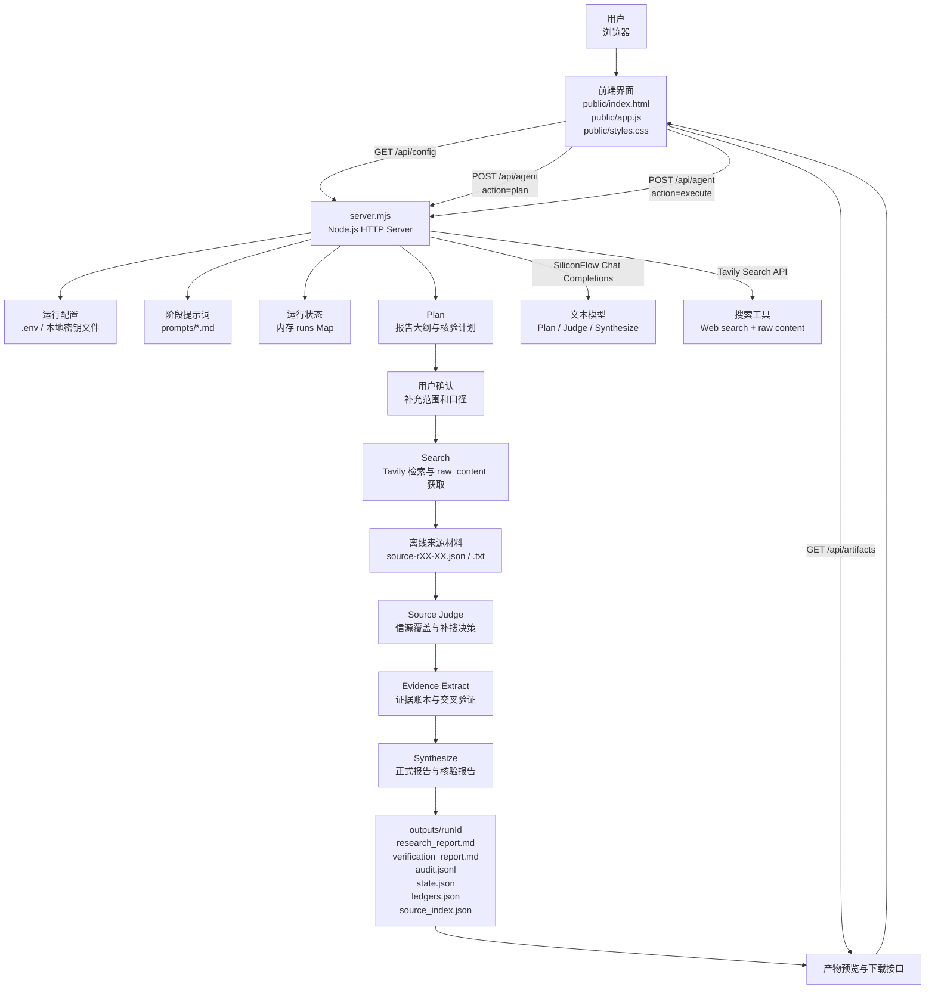
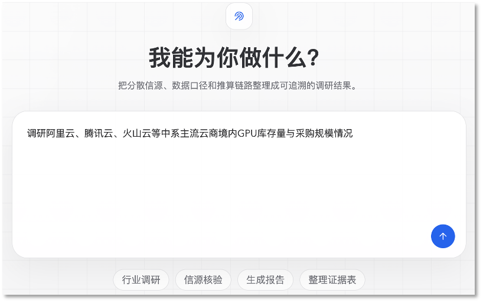
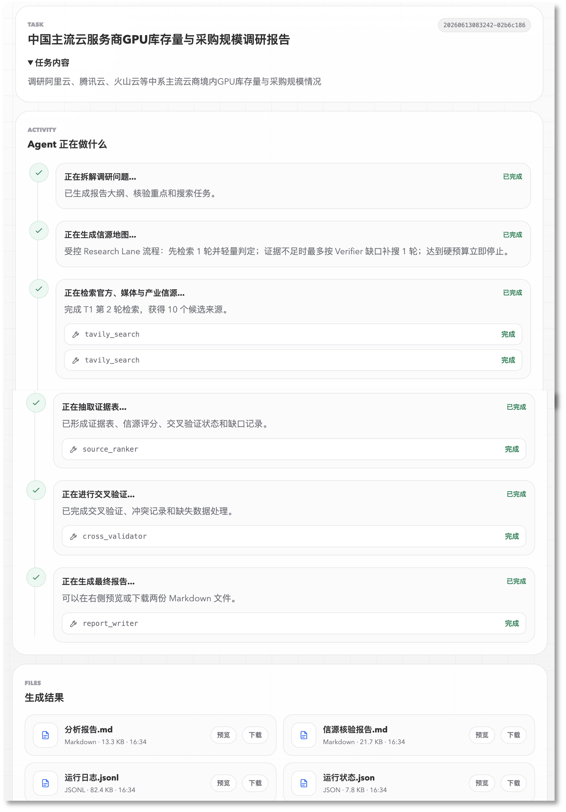

# 信源整合型调研 Agent

信源整合型调研 Agent 是一个本地运行的研究报告生成工具。它面向行业研究、公司研究、竞品分析、投资备忘录、尽职调查、政策/技术/商业研究等任务，核心目标不是简单生成一段回答，而是把调研过程拆成可审计的 Agent 流程：先确认报告结构和核验重点，再联网检索、读取公开来源、抽取证据、判断信源质量，最后同时输出正式报告和核验报告。

项目采用无框架的 Node.js HTTP 服务和原生前端实现。后端集中在 `server.mjs`，前端集中在 `public/`，阶段提示词放在 `prompts/`，运行产物写入 `outputs/<runId>/`。默认搜索工具是 Tavily，文本模型接口使用 SiliconFlow 的 OpenAI 兼容 Chat Completions API。

## 项目 Demo

Agent 任务输入界面支持直接输入调研问题，也可以从下方快捷任务进入行业调研、信源核验、生成报告或整理证据表等常见场景。



Agent 运行完成后，页面会展示本次任务的执行流、真实工具调用状态，以及最终生成的分析报告、信源核验报告、运行日志和运行状态文件，用户可以在页面中预览或下载产物。



## 核心能力

- 两阶段 Agent 流程：先生成报告大纲、搜索任务、核验重点和缺失数据处理预案，等待用户确认后才开始联网检索。
- 真实搜索与原文保存：后端调用 Tavily Search，保存搜索请求、响应、网页正文和来源切片，模型不能自行编造搜索结果。
- 信源分级与核验：按 S/A/B/C/D 对来源做初步分层，检查主体、时间、地域、单位、币种、统计口径、来源链条和方法透明度。
- 交叉验证与降级表达：对关键事实、数据、判断和推算建立 claim cluster，证据不足时补搜、降级、标记未知或删除不可靠结论。
- 上下文外置策略：完整来源正文落盘保存，模型上下文只接收相关 source card 和 chunk；当需要更多原文时，通过 readback 读取指定片段。
- 预算控制：限制搜索轮数、Tavily credit、模型调用次数、模型 token 和运行时长，避免单次任务失控。
- 双报告输出：`research_report.md` 面向最终读者，`verification_report.md` 记录完整证据、评分、口径、计算、冲突、缺口和正文映射。
- 审计日志：每次模型调用、工具调用、运行阶段和文件路径都会写入 `audit.jsonl`，便于复盘和调试。

## 工作流程

1. 用户在 Web UI 输入调研任务。
2. 后端读取 `prompts/plan.md`，调用文本模型生成报告大纲、核验重点、搜索任务和确认问题。
3. 前端展示计划，用户可以补充时间范围、主体口径、格式要求或是否允许推算。
4. 用户确认后，后端按计划调用 Tavily Search，并把每轮搜索结果、raw content、来源 JSON 和来源文本写入本地运行目录。
5. Source Judge 阶段判断当前来源是否足够支撑后续成稿；如果缺口明确且预算允许，会进行定向补搜。
6. Evidence Extract 阶段构建证据账本、来源卡片、信源覆盖、缺失数据、冲突记录和交叉验证结果。
7. Synthesize 阶段基于已核验证据生成正式报告和核验报告；如果证据不足，会生成降级版结果并明确原因。
8. 前端展示可预览和下载的产物文件。

## 目录结构

```text
.
├── server.mjs                         # 本地 HTTP 服务、Agent 编排、模型/搜索调用、产物持久化
├── package.json                       # npm 脚本
├── public/
│   ├── index.html                     # 单页应用入口
│   ├── app.js                         # 前端状态机、流式事件处理、报告预览
│   └── styles.css                     # 页面样式
├── prompts/
│   ├── base.md                        # Agent 身份与底线
│   ├── plan.md                        # 规划阶段提示词
│   ├── search.md                      # 后端搜索阶段说明
│   ├── source-judge.md                # 轻量信源判断与补搜决策
│   ├── extract-score.md               # 证据抽取、评分、交叉验证规范
│   └── synthesize.md                  # 正式报告与核验报告生成规范
├── scripts/
│   ├── tavily-smoke-test.mjs          # Tavily 搜索连通性测试
│   └── e2e-smoke-test.mjs             # 端到端 Agent 冒烟测试
├── source-verified-research/          # 可复用的信源核验型研究 Skill 说明和参考资料
├── docs/images/                       # 项目 Demo 图片目录
└── outputs/                           # 本地运行产物，已被 .gitignore 忽略
```

## 运行方式

项目没有第三方 npm 依赖，要求 Node.js 18 或更高版本，因为代码依赖内置 `fetch` 和 ESM。

1. 准备环境变量：

```bash
cp .env.example .env
```

然后在 `.env` 中至少配置：

```bash
TAVILY_API_KEY=tvly-your-api-key
TAVILY_BASE_URL=https://api.tavily.com
TAVILY_ENABLE_SEARCH=true

SILICONFLOW_API_KEY=your-siliconflow-api-key
SILICONFLOW_BASE_URL=https://api.siliconflow.cn/v1
SILICONFLOW_MODEL=Pro/MiniMaxAI/MiniMax-M2.5
```

项目也兼容读取根目录下的 `tavily搜索 api.txt` 和 `硅基 api.txt`，但推荐使用 `.env` 管理配置，并确保所有密钥文件不要提交到 Git。

2. 启动本地服务：

```bash
npm run dev
```

默认监听 `http://127.0.0.1:3000`。如果 3000 端口被占用，服务会自动尝试后续端口，并在终端输出实际地址。

3. 打开浏览器访问终端显示的本地地址，输入任务并按页面流程确认计划、执行检索和查看产物。

## 常用配置

- `PORT`：本地服务首选端口，默认 `3000`。
- `TAVILY_SEARCH_DEPTH`：Tavily 搜索深度，默认 `basic`。
- `TAVILY_MAX_RESULTS`：单轮最大搜索结果数，默认 `10`，代码上限为 `20`。
- `MAX_SEARCH_ROUNDS`：最多搜索轮数，默认 `2`。
- `MAX_RESEARCH_LANES`：研究 lane 数，默认 `1`，代码上限为 `3`。
- `MAX_TAVILY_CREDITS_PER_RUN`：单次运行 Tavily credit 硬预算。
- `MAX_MODEL_CALLS_PER_RUN`：单次运行模型调用硬预算。
- `MAX_TOTAL_MODEL_TOKENS_PER_RUN`：单次运行总 token 硬预算。
- `MAX_WALL_TIME_SECONDS_PER_RUN`：执行阶段最大运行时长。
- `ENABLE_FULL_EXTRACTION_MODEL`：是否启用完整证据抽取模型。默认 `false`，即使用真实来源和网页正文确定性构建证据表，减少额外模型调用。
- `SILICONFLOW_PLAN_MODEL`、`SILICONFLOW_JUDGE_MODEL`、`SILICONFLOW_EXTRACT_MODEL`、`SILICONFLOW_SYNTHESIZE_MODEL`：分别覆盖不同阶段使用的模型。

更多默认值可以查看 `.env.example` 和 `server.mjs` 顶部的 `config`。

## 输出产物

每次任务会生成一个 `runId`，对应目录为 `outputs/<runId>/`。该目录不会提交到 Git，适合存放本地审计材料。

常见文件包括：

- `research_report.md`：正式报告，只放面向读者的结论、分析、必要推算和谨慎来源说明。
- `verification_report.md`：核验报告，记录信源覆盖、评分、证据表、时间口径、计算过程、逻辑链、冲突、缺口和正文映射。
- `audit.jsonl`：运行审计日志，逐行记录模型调用、工具调用、阶段事件、耗时、用量和文件路径。
- `state.json`：当前 run 的结构化状态。
- `ledgers.json`：来源、证据、claim、缺口和 verifier issue 等账本。
- `source_index.json`：来源索引，包含 source id、URL、发布方、等级、正文长度、chunk 数和离线文件路径。
- `source-rXX-XX.json` / `source-rXX-XX.txt`：每个来源的结构化记录和清洗后的正文。
- `0001-...-prompt.txt`、`0001-...-request.json`、`0001-...-response.json`：模型和工具调用的请求/响应审计文件。

## 冒烟测试

Tavily 连通性测试：

```bash
npm run smoke:tavily
```

端到端测试需要先启动本地服务，并准备好 Tavily 与 SiliconFlow 配置：

```bash
npm run dev
npm run smoke:e2e
```

如果服务不是跑在默认地址，可以指定：

```bash
AGENT_BASE_URL=http://127.0.0.1:3001 npm run smoke:e2e
```

端到端测试会提交一个小型调研任务，检查是否产生真实搜索调用、来源、审计日志和报告文件。

## 设计取向

这个项目有意把“报告写作”和“信源核验”分开处理。正式报告不堆砌完整搜索过程，避免读者被证据表淹没；核验报告则保留足够细的追溯信息，便于检查每个结论是否有来源、时间、口径和计算链路支撑。

后端也有意把上下文管理做成“外置原文、按需回读”的方式。Tavily 返回的 raw content 会被保存为本地来源文件，模型只看到与任务最相关的片段。这样可以降低上下文噪声，同时保留完整审计路径：当模型需要更多原文时，必须通过结构化 `context_requests` 请求后端回读，而不是凭空补全。
